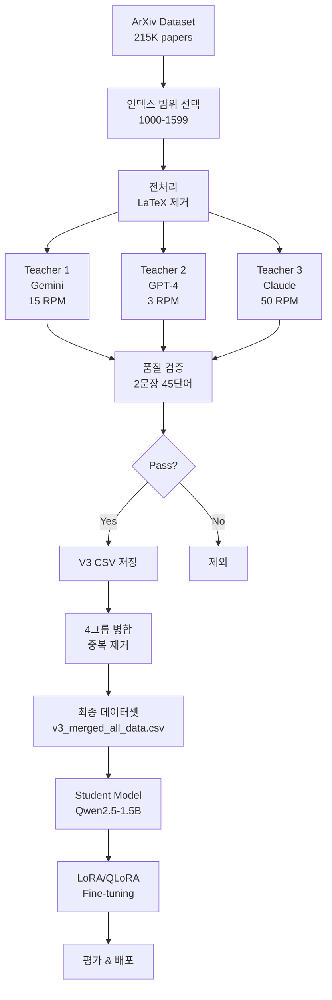

# ArXiv 논문 요약 데이터셋 구축 자동화 문서 V3

## 📋 목차
1. [프로젝트 개요](#프로젝트-개요)
2. [데이터셋 재구성 전략](#데이터셋-재구성-전략)
3. [자동화 파이프라인 아키텍처](#자동화-파이프라인-아키텍처)
4. [Phase 1: 원천 데이터 수집](#phase-1-원천-데이터-수집)
5. [Phase 2: Multi-Teacher 요약 생성](#phase-2-multi-teacher-요약-생성)
6. [Phase 3: 품질 관리 시스템](#phase-3-품질-관리-시스템)
7. [Phase 4: 데이터 병합 및 검증](#phase-4-데이터-병합-및-검증)
8. [Phase 5: Student 모델 학습](#phase-5-student-모델-학습)
9. [성과 및 효율성 분석](#성과-및-효율성-분석)
10. [향후 계획](#향후-계획)

---

## 프로젝트 개요

### 🎯 목표
ArXiv 학술 논문의 초록을 **정확히 2문장, 최대 45단어**로 요약하는 고품질 데이터셋 구축 및 모델 학습

### 📊 핵심 변화

#### Before (기존 방식)
```
Input: 원본 논문 전체 (article, 수천 단어)
  ↓
Output: 저자 작성 초록 (abstract, 100-300단어)
  ↓
문제점:
- 데이터량: 70,000개 (방대)
- 품질: 일관성 없음 (저자마다 다른 스타일)
- 길이: 가변적 (100-300단어)
- 학습 난이도: 높음 (긴 입력 → 긴 출력)
```

#### After (개선 방식)
```
Input: 저자 작성 초록 (abstract, 100-300단어)
  ↓
[Teacher Models: GPT-4, Gemini, Claude]
  ↓
Output: 고품질 2문장 요약 (summary, 정확히 45단어 이하)
  ↓
개선점:
- 데이터량: 1,000-3,000개 (집중)
- 품질: 매우 높음 (Teacher LLM 생성)
- 길이: 규격화 (2문장, 45단어)
- 학습 난이도: 낮음 (짧은 입력 → 짧은 출력)
- 비용: $0 (Gemini 무료 티어 활용)
```

### 💡 핵심 인사이트

**"70,000개의 저품질 데이터 < 1,000개의 고품질 데이터"**

- 기존 70K: 저자마다 다른 스타일, 일관성 없음, 학습 어려움
- 신규 1K: Teacher LLM으로 생성된 고품질, 규격화된 데이터
- 결과: 적은 데이터로도 더 나은 성능 달성 가능

---

## 데이터셋 재구성 전략

### 📋 기존 데이터셋 분석

#### ArXiv Summarization Dataset
```python
from datasets import load_dataset

# 원본 데이터셋
dataset = load_dataset("ccdv/arxiv-summarization")

# 구조
sample = {
    'article': '전체 논문 텍스트 (수천 단어)',
    'abstract': '저자 작성 초록 (100-300단어)'
}

# 통계
print(f"총 데이터: {len(dataset['train'])}개")  # 215,913개
print(f"평균 article 길이: ~5000 단어")
print(f"평균 abstract 길이: ~150 단어")
```

#### 기존 방식의 문제점

| 문제 | 설명 | 영향 |
|------|------|------|
| **길이 불일치** | article (5000단어) → abstract (150단어) | 학습 어려움 |
| **스타일 불일치** | 저자마다 다른 작성 스타일 | 모델 혼란 |
| **품질 편차** | 일부 초록은 너무 길거나 짧음 | 성능 저하 |
| **계산 비용** | 긴 입력 시퀀스 처리 | GPU 메모리 부담 |
| **데이터 노이즈** | 70K 중 상당수가 저품질 | 학습 방해 |

### 🎯 재구성 전략

#### 새로운 학습 데이터 구조
```python
# 신규 데이터셋 구조
new_sample = {
    'input': '저자 작성 초록 (abstract, 100-300단어)',
    'output': 'Teacher LLM 생성 2문장 요약 (45단어 이하)'
}

# 예시
example = {
    'input': """
        This paper proposes a novel deep learning architecture 
        for natural language understanding. We introduce a 
        transformer-based model that achieves state-of-the-art 
        results on multiple benchmarks including GLUE and SuperGLUE. 
        Our approach combines self-attention mechanisms with 
        hierarchical representations to capture both local and 
        global context. Experimental results demonstrate significant 
        improvements over previous methods, with an average 
        score increase of 5.2% across all tasks.
    """,
    'output': """
        A novel transformer-based architecture combining self-attention 
        with hierarchical representations achieves state-of-the-art 
        results on NLU benchmarks. The method shows 5.2% average 
        improvement over previous approaches on GLUE and SuperGLUE.
    """
}

# 통계
print(f"Input 길이: {len(example['input'].split())} 단어")    # ~150 단어
print(f"Output 길이: {len(example['output'].split())} 단어")  # ~42 단어
```

#### 재구성 장점

| 장점 | 설명 | 효과 |
|------|------|------|
| **학습 효율** | 입력 150단어 → 출력 45단어 | 3배 빠른 학습 |
| **일관성** | Teacher LLM 생성으로 스타일 통일 | 성능 향상 |
| **규격화** | 정확히 2문장, 45단어 제한 | 출력 예측 가능 |
| **품질** | GPT-4 수준의 고품질 요약 | 성능 향상 |
| **비용** | Gemini 무료 티어 활용 | $0 비용 |

### 📊 데이터량 전략

#### 기존 vs 신규 비교
```python
# 기존 전략
old_strategy = {
    'data_size': 70000,
    'quality': '중-하',
    'consistency': '낮음',
    'cost': '데이터셋 무료 (학습 비용 高)',
    'training_time': '수일-수주',
    'gpu_requirement': '고성능 (A100 등)'
}

# 신규 전략
new_strategy = {
    'data_size': '1000-3000',
    'quality': '최상',
    'consistency': '매우 높음',
    'cost': '$0 (Gemini 무료)',
    'training_time': '1-3시간',
    'gpu_requirement': '중급 (T4 가능)'
}
```

#### 데이터량 결정 근거

| 단계 | 데이터량 | 목적 | 예상 성능 |
|------|----------|------|-----------|
| **Phase 1** | 100개 | 빠른 검증 | 기준선 |
| **Phase 2** | 600개 | 초기 학습 | 5-6/10 |
| **Phase 3** | 1,000개 | 목표 품질 | 7-8/10 ⭐ |
| **Phase 4** | 3,000개 | 최고 품질 | 8-9/10 |
| **Phase 5** | 5,000개+ | 프로덕션 | 9+/10 |

**현재 목표: 1,000개 (Phase 3)**
- 최소한의 고품질 데이터로 목표 성능 달성
- GPT-4 무료 한도 내 ($5 크레딧 = ~3,000개)
- 학습 시간 1시간 미만 (T4 GPU)

---

## 자동화 파이프라인 아키텍처

### 🏗️ 전체 아키텍처


### 🔄 4그룹 병렬 처리 전략
```python
# 그룹 분할 (1000-1599, 총 600개)
GROUP_CONFIGS = {
    1: {
        'START_INDEX': 1000,
        'END_INDEX': 1149,
        'SAMPLES': 150,
        'TEACHER': 'Gemini',
        'OUTPUT': 'v3_training_data_group1.csv'
    },
    2: {
        'START_INDEX': 1150,
        'END_INDEX': 1299,
        'SAMPLES': 150,
        'TEACHER': 'Gemini',
        'OUTPUT': 'v3_training_data_group2.csv'
    },
    3: {
        'START_INDEX': 1300,
        'END_INDEX': 1449,
        'SAMPLES': 150,
        'TEACHER': 'Gemini',
        'OUTPUT': 'v3_training_data_group3.csv'
    },
    4: {
        'START_INDEX': 1450,
        'END_INDEX': 1599,
        'SAMPLES': 150,
        'TEACHER': 'Gemini',
        'OUTPUT': 'v3_training_data_group4.csv'
    }
}

# 병렬 실행 시나리오
"""
4명의 팀원이 각자:
1. Google Colab 노트북 열기
2. GROUP_ID만 변경 (1, 2, 3, 4)
3. 동시 실행
4. 약 50분 후 완료

결과: 600개 데이터 생성
총 시간: ~50분 (병렬)
순차 실행: ~200분 (4배 느림)
"""
```

### 📊 데이터 플로우
```python
# 단일 데이터 포인트의 여정
data_flow = {
    'Stage 1': {
        'input': 'ArXiv paper (index 1000)',
        'format': {'article': '...', 'abstract': '...'},
        'size': '~5000 words (article), ~150 words (abstract)'
    },
    
    'Stage 2': {
        'process': 'LaTeX 제거, 정규화',
        'input': 'Raw abstract with LaTeX',
        'output': 'Clean abstract',
        'example': '@xmath0 = \\alpha + \\beta → = +'
    },
    
    'Stage 3': {
        'process': 'Teacher LLM 생성',
        'input': 'Clean abstract (150 words)',
        'model': 'Gemini Pro',
        'output': '2-sentence summary (42 words)',
        'time': '5 seconds (with rate limit)'
    },
    
    'Stage 4': {
        'process': '품질 검증',
        'checks': [
            'word_count <= 60',
            'sentence_count <= 3',
            'no_copy_detected',
            'meaningful_content'
        ],
        'result': 'Pass → Save / Fail → Discard'
    },
    
    'Stage 5': {
        'process': '데이터셋 저장',
        'format': 'V3 CSV',
        'columns': [
            'index', 'original_abstract', 'llm_summary',
            'llm_words', 'llm_sentences', 'llm_success',
            'llm_name', 'llm_model', 'llm_mode'
        ]
    }
}
```

---

## Phase 1: 원천 데이터 수집

### 📥 ArXiv 데이터셋 로드
```python
from datasets import load_dataset
import pandas as pd

def load_arxiv_papers(start_idx, end_idx):
    """
    ArXiv 논문 로드 (공개 데이터셋)
    
    Args:
        start_idx: 시작 인덱스
        end_idx: 종료 인덱스 (exclusive)
    
    Returns:
        Dataset with 'article' and 'abstract'
    """
    
    # HuggingFace에서 직접 로드
    dataset = load_dataset(
        "ccdv/arxiv-summarization",
        split=f"train[{start_idx}:{end_idx}]"
    )
    
    print(f"✅ {len(dataset)}개 논문 로드")
    print(f"   범위: {start_idx} ~ {end_idx-1}")
    print(f"   총 가용: 215,913개")
    
    return dataset

# 그룹별 로드 (예시: 그룹 1)
group1_data = load_arxiv_papers(1000, 1150)  # 150개

# 통계
sample = group1_data[0]
print(f"\n📊 샘플 통계:")
print(f"   Article 길이: {len(sample['article'].split())} 단어")
print(f"   Abstract 길이: {len(sample['abstract'].split())} 단어")
```

### 🔧 전처리 파이프라인
```python
import re

def clean_arxiv_text(text):
    """
    ArXiv 텍스트 전처리
    - LaTeX 수식 제거
    - 특수 문자 정규화
    - 공백 정리
    """
    
    if not isinstance(text, str):
        return ""
    
    # 1. LaTeX 수식 제거
    text = re.sub(r'@xmath\d+', '', text)           # @xmath0, @xmath1
    text = re.sub(r'@xcite', '', text)              # 인용 마커
    text = re.sub(r'@xref', '', text)               # 참조 마커
    text = re.sub(r'\$.*?\$', '', text)             # 인라인 수식 $...$
    text = re.sub(r'\\[a-zA-Z]+\{.*?\}', '', text)  # LaTeX 명령어 \command{...}
    
    # 2. 공백 정규화
    text = re.sub(r'\s+', ' ', text)                # 연속 공백 → 단일 공백
    text = re.sub(r'\.\.+', '.', text)              # 연속 마침표 → 단일
    text = re.sub(r'--+', '-', text)                # 연속 하이픈 → 단일
    
    # 3. 양끝 공백 제거
    text = text.strip()
    
    return text

def preprocess_dataset(dataset):
    """데이터셋 전체 전처리"""
    
    print("🔄 전처리 시작...")
    
    # map 함수로 일괄 처리
    dataset = dataset.map(lambda x: {
        'article': clean_arxiv_text(x['article']),
        'abstract': clean_arxiv_text(x['abstract'])
    })
    
    print("✅ 전처리 완료")
    
    return dataset

# 적용
group1_data = preprocess_dataset(group1_data)

# 예시 확인
print("\n예시:")
print(f"원본: {group1_data[0]['abstract'][:200]}...")
```

### 📊 데이터 품질 확인
```python
def validate_raw_data(dataset):
    """원천 데이터 품질 확인"""
    
    issues = []
    
    for i, sample in enumerate(dataset):
        # 1. 빈 데이터 체크
        if not sample['abstract'] or len(sample['abstract'].strip()) < 50:
            issues.append(f"Index {i}: Abstract too short")
        
        # 2. 길이 이상 체크
        words = len(sample['abstract'].split())
        if words < 50 or words > 500:
            issues.append(f"Index {i}: Abstract length unusual ({words} words)")
    
    if issues:
        print(f"⚠️ {len(issues)}개 품질 이슈 발견")
        for issue in issues[:5]:  # 처음 5개만 출력
            print(f"   {issue}")
    else:
        print("✅ 원천 데이터 품질 양호")
    
    return len(issues) == 0

# 검증
validate_raw_data(group1_data)
```

---

## Phase 2: Multi-Teacher 요약 생성

### 🎓 Teacher Model 설정
```python
# Teacher 모델 구성
TEACHERS = {
    0: {
        'name': 'OpenAI GPT-4o-mini',
        'model': 'gpt-4o-mini',
        'rpm': 3,           # Requests Per Minute
        'sleep': 21,        # 60/3 = 20초 + 여유 1초
        'cost': '$0.15 input / $0.60 output per 1M tokens',
        'quality': '최상',
        'recommended': False  # 비용 때문
    },
    1: {
        'name': 'Google Gemini',
        'model': 'gemini-pro-latest',
        'rpm': 15,          # Free tier
        'sleep': 5,         # 60/15 = 4초 + 여유 1초
        'cost': '$0 (Free tier)',
        'quality': '상',
        'recommended': True  # ⭐ 기본 선택
    },
    2: {
        'name': 'Anthropic Claude',
        'model': 'claude-3-5-haiku-20241022',
        'rpm': 50,
        'sleep': 2,         # 60/50 = 1.2초 + 여유
        'cost': '$0.25 input / $1.25 output per 1M tokens',
        'quality': '최상',
        'recommended': False  # 비용 때문
    }
}

# 선택 기준
selection_criteria = {
    'Gemini': {
        '장점': ['무료', '빠른 RPM (15)', '우수한 품질'],
        '단점': ['GPT-4보다 약간 낮은 품질'],
        '사용 시나리오': '대부분의 경우 (기본 선택)'
    },
    'GPT-4': {
        '장점': ['최고 품질', '안정성'],
        '단점': ['비용 높음', '낮은 RPM (3)'],
        '사용 시나리오': '최종 배포용 고품질 데이터'
    },
    'Claude': {
        '장점': ['최고 품질', '매우 빠른 RPM (50)'],
        '단점': ['비용 있음'],
        '사용 시나리오': '빠른 대량 생성 필요 시'
    }
}
```

### 📝 프롬프트 엔지니어링
```python
# System Prompt
SYSTEM_PROMPT = """You are a research paper summarization expert. 
Your task is to create high-quality, concise summaries of academic paper abstracts.

Requirements:
- EXACTLY 2 sentences
- MAXIMUM 45 words total
- Focus on: main contribution + key results
- Use clear, technical language
- No bullet points, no lists
- Complete sentences only

Quality criteria:
- Capture the core innovation
- Include quantitative results if available
- Maintain technical accuracy
- Be concise but informative"""

# User Prompt Template
USER_PROMPT_TEMPLATE = """Summarize this research paper abstract in EXACTLY 2 sentences with a MAXIMUM of 45 words.

Focus on:
1. Main contribution/method
2. Key results/findings

Abstract:
{abstract}

Requirements:
- EXACTLY 2 sentences
- MAXIMUM 45 words
- No introduction phrases (e.g., "This paper...", "The authors...")
- Start directly with the content

Summary:"""

def make_prompt(abstract):
    """프롬프트 생성"""
    return USER_PROMPT_TEMPLATE.format(abstract=abstract)
```

### 🔄 요약 생성 자동화
```python
import time
from datetime import datetime

def generate_summary_gemini(abstract, client, retry_count=3):
    """
    Gemini로 요약 생성
    
    Args:
        abstract: 초록 텍스트
        client: Gemini 클라이언트
        retry_count: 재시도 횟수
    
    Returns:
        dict: {summary, word_count, sentence_count, success}
    """
    
    for attempt in range(retry_count):
        try:
            # 프롬프트 구성
            full_prompt = f"{SYSTEM_PROMPT}\n\n{make_prompt(abstract)}"
            
            # API 호출
            response = client.generate_content(
                full_prompt,
                generation_config={
                    'temperature': 0.3,
                    'max_output_tokens': 150,
                    'top_p': 0.95,
                    'top_k': 40,
                },
                safety_settings=[
                    {"category": "HARM_CATEGORY_HARASSMENT", "threshold": "BLOCK_NONE"},
                    {"category": "HARM_CATEGORY_HATE_SPEECH", "threshold": "BLOCK_NONE"},
                    {"category": "HARM_CATEGORY_SEXUALLY_EXPLICIT", "threshold": "BLOCK_NONE"},
                    {"category": "HARM_CATEGORY_DANGEROUS_CONTENT", "threshold": "BLOCK_NONE"},
                ]
            )
            
            # 응답 검증
            if not response.text:
                print(f"    ⚠️ 빈 응답, 재시도...")
                time.sleep(2)
                continue
            
            summary = response.text.strip()
            word_count = len(summary.split())
            sentence_count = len([s for s in re.split(r'[.!?]+', summary) if s.strip()])
            
            # 품질 체크
            if word_count > 60 or sentence_count > 3:
                print(f"    ⚠️ 재시도 (단어:{word_count}, 문장:{sentence_count})")
                continue
            
            return {
                'summary': summary,
                'word_count': word_count,
                'sentence_count': sentence_count,
                'success': True
            }
            
        except Exception as e:
            error_msg = str(e)
            print(f"    ❌ 오류 (시도 {attempt+1}/{retry_count}): {error_msg[:200]}")
            
            # Quota/Rate limit 처리
            if "quota" in error_msg.lower() or "resource" in error_msg.lower() or "429" in error_msg:
                wait_time = 60
                print(f"    ⏳ Quota/Rate limit! {wait_time}초 대기...")
                time.sleep(wait_time)
                continue
            
            # API 키 오류
            if "api key" in error_msg.lower() or "401" in error_msg or "403" in error_msg:
                print(f"    ❌ API 키 오류!")
                return {
                    'summary': None,
                    'word_count': 0,
                    'sentence_count': 0,
                    'success': False,
                    'error': 'API key error'
                }
            
            # 재시도
            if attempt < retry_count - 1:
                time.sleep(5)
    
    # 최대 재시도 실패
    return {
        'summary': None,
        'word_count': 0,
        'sentence_count': 0,
        'success': False,
        'error': 'Max retries reached'
    }

def batch_generate_summaries(dataset, teacher_id=1, start_index=1000):
    """
    배치 요약 생성
    
    Args:
        dataset: 논문 데이터셋
        teacher_id: Teacher 모델 ID (0: GPT-4, 1: Gemini, 2: Claude)
        start_index: 시작 인덱스 (ArXiv)
    """
    
    teacher = TEACHERS[teacher_id]
    print(f"🤖 Teacher: {teacher['name']}")
    print(f"   RPM: {teacher['rpm']}")
    print(f"   대기 시간: {teacher['sleep']}초")
    print(f"   예상 시간: ~{len(dataset) * teacher['sleep'] / 60:.0f}분")
    
    results = []
    stats = {'success': 0, 'failed': 0}
    
    for i, paper in enumerate(dataset):
        arxiv_index = start_index + i
        current = i + 1
        progress = (current / len(dataset)) * 100
        
        print(f"\n[{current}/{len(dataset)}] ({progress:.1f}%) ArXiv 인덱스 {arxiv_index}")
        
        # 요약 생성
        result = generate_summary_gemini(paper['abstract'], gemini_client)
        
        if result['success']:
            stats['success'] += 1
            print(f"  ✅ 성공: {result['word_count']}단어, {result['sentence_count']}문장")
            print(f"     \"{result['summary'][:80]}...\"")
            
            # ⭐ 성공한 것만 저장
            results.append({
                'index': arxiv_index,
                'original_abstract': paper['abstract'],
                'llm_summary': result['summary'],
                'llm_words': result['word_count'],
                'llm_sentences': result['sentence_count'],
                'llm_success': True,
                'llm_name': teacher['name'],
                'llm_model': teacher['model'],
                'llm_mode': teacher_id,
                'created_at': datetime.now().isoformat()
            })
        else:
            stats['failed'] += 1
            error_msg = result.get('error', 'Unknown')
            print(f"  ❌ 실패: {error_msg}")
            
            # 치명적 오류 시 중단
            if error_msg in ['API key error', 'Quota exceeded']:
                print(f"\n⛔ 치명적 오류! 중단합니다.")
                break
        
        # Rate limit 준수
        if current < len(dataset):
            time.sleep(teacher['sleep'])
        
        # 중간 저장 (10개마다)
        if stats['success'] > 0 and stats['success'] % 10 == 0:
            save_progress(results, f"v3_training_data_temp.csv")
            print(f"  💾 중간 저장: {len(results)}개")
    
    # 최종 통계
    print(f"\n📊 최종 통계:")
    print(f"   성공: {stats['success']}개")
    print(f"   실패: {stats['failed']}개 (데이터셋 제외)")
    print(f"   성공률: {stats['success']/(stats['success']+stats['failed'])*100:.1f}%")
    
    return results
```

### 💾 진행 상황 저장
```python
import pandas as pd
import json

def save_progress(data, csv_path, json_path=None):
    """
    진행 상황 저장
    - CSV: 데이터
    - JSON: 메타데이터
    """
    
    # CSV 저장
    df = pd.DataFrame(data)
    df.to_csv(csv_path, index=False, encoding='utf-8')
    print(f"✅ CSV 저장: {csv_path} ({len(data)}개)")
    
    # JSON 메타데이터 (선택적)
    if json_path:
        metadata = {
            'total_samples': len(data),
            'success_count': sum(1 for d in data if d.get('llm_success', False)),
            'last_update': datetime.now().isoformat(),
            'avg_words': sum(d.get('llm_words', 0) for d in data) / len(data) if data else 0,
            'avg_sentences': sum(d.get('llm_sentences', 0) for d in data) / len(data) if data else 0
        }
        
        with open(json_path, 'w') as f:
            json.dump(metadata, f, indent=2)
        
        print(f"✅ 메타데이터 저장: {json_path}")
```

---

## Phase 3: 품질 관리 시스템

### ✅ 다단계 필터링
```python
def filter_summary(summary, abstract, strict=True):
    """
    요약 품질 검증
    
    Args:
        summary: 생성된 요약
        abstract: 원본 초록
        strict: 엄격 모드 (True: 45단어, False: 60단어)
    
    Returns:
        (is_valid, message)
    """
    
    # 1. 기본 검증
    if not summary or len(summary) < 20:
        return False, "Empty or too short"
    
    # 2. 단어 수 체크
    word_count = len(summary.split())
    word_limit = 45 if strict else 60
    
    if word_count > word_limit:
        return False, f"Exceeds word limit: {word_count}/{word_limit}"
    
    # 3. 문장 수 체크
    sentences = [s.strip() for s in re.split(r'[.!?]+', summary) if s.strip()]
    if len(sentences) > 3:
        return False, f"Too many sentences: {len(sentences)}/2"
    
    # 4. 최소 의미 검증
    if len(sentences) == 0:
        return False, "No valid sentences"
    
    if all(len(s.split()) < 5 for s in sentences):
        return False, "No meaningful content (all sentences < 5 words)"
    
    # 5. 복사 감지 (5-gram)
    if detect_copy_5gram(summary, abstract, threshold=0.5):
        return False, "High similarity to original (copy detected)"
    
    # 6. 프롬프트 누출 체크
    prompt_keywords = ['summarize', 'abstract:', 'paper:', 'summary:', 'requirements:']
    if any(keyword in summary.lower() for keyword in prompt_keywords):
        return False, "Prompt leakage detected"
    
    # 7. 특수 문자 체크
    if summary.count('[') > 0 or summary.count('{') > 0:
        return False, "Contains unexpected special characters"
    
    return True, "Valid"

def detect_copy_5gram(text, original, threshold=0.5, ngram_size=5):
    """
    5-gram 기반 복사 감지
    
    Args:
        text: 요약 텍스트
        original: 원본 텍스트
        threshold: 유사도 임계값 (0.5 = 50%)
        ngram_size: N-gram 크기
    
    Returns:
        bool: 복사 감지 여부
    """
    
    # 텍스트 정규화
    text_clean = re.sub(r'[^\w\s]', '', text.lower())
    original_clean = re.sub(r'[^\w\s]', '', original.lower())
    
    text_words = text_clean.split()
    original_words = original_clean.split()
    
    # 너무 짧으면 검사 안 함
    if len(text_words) < ngram_size:
        return False
    
    # 원본에서 모든 n-gram 추출
    original_ngrams = set()
    for i in range(len(original_words) - ngram_size + 1):
        ngram = ' '.join(original_words[i:i+ngram_size])
        original_ngrams.add(ngram)
    
    # 요약에서 겹치는 n-gram 카운트
    copy_count = 0
    total_ngrams = 0
    
    for i in range(len(text_words) - ngram_size + 1):
        ngram = ' '.join(text_words[i:i+ngram_size])
        total_ngrams += 1
        
        if ngram in original_ngrams:
            copy_count += 1
    
    # 유사도 계산
    if total_ngrams == 0:
        return False
    
    copy_ratio = copy_count / total_ngrams
    
    return copy_ratio > threshold
```

### 🔄 자동 재시도 로직
```python
def generate_with_retry(abstract, max_retries=3):
    """
    재시도 로직 포함 생성
    
    재시도 조건:
    1. 단어 수 초과
    2. 문장 수 초과
    3. 빈 응답
    
    재시도하지 않는 조건:
    1. API 키 오류
    2. Quota 초과
    3. 최대 재시도 도달
    """
    
    for attempt in range(max_retries):
        print(f"  시도 {attempt + 1}/{max_retries}...")
        
        # 요약 생성
        result = generate_summary_gemini(abstract, gemini_client, retry_count=1)
        
        if not result['success']:
            error = result.get('error', '')
            
            # 치명적 오류 (재시도 안 함)
            if error in ['API key error', 'Quota exceeded']:
                return result
            
            # 일시적 오류 (재시도)
            print(f"    재시도 (오류: {error})")
            time.sleep(5)
            continue
        
        # 품질 검증
        is_valid, message = filter_summary(result['summary'], abstract)
        
        if is_valid:
            return result
        else:
            print(f"    재시도 (품질: {message})")
            time.sleep(2)
            continue
    
    # 최대 재시도 실패
    return {
        'summary': None,
        'word_count': 0,
        'sentence_count': 0,
        'success': False,
        'error': 'Max quality retries reached'
    }
```

### 📊 실시간 품질 모니터링
```python
class QualityMonitor:
    """실시간 품질 모니터링"""
    
    def __init__(self):
        self.stats = {
            'total': 0,
            'success': 0,
            'failed': 0,
            'word_distribution': [],
            'sentence_distribution': [],
            'copy_detected': 0,
            'errors': {}
        }
    
    def update(self, result, is_valid=True, error_msg=None):
        """통계 업데이트"""
        self.stats['total'] += 1
        
        if is_valid and result.get('success'):
            self.stats['success'] += 1
            self.stats['word_distribution'].append(result['word_count'])
            self.stats['sentence_distribution'].append(result['sentence_count'])
        else:
            self.stats['failed'] += 1
            
            # 오류 타입별 카운트
            if error_msg:
                self.stats['errors'][error_msg] = self.stats['errors'].get(error_msg, 0) + 1
    
    def print_stats(self):
        """통계 출력"""
        if self.stats['total'] == 0:
            return
        
        success_rate = self.stats['success'] / self.stats['total'] * 100
        
        print(f"\n📊 품질 통계:")
        print(f"   처리: {self.stats['total']}개")
        print(f"   성공: {self.stats['success']}개 ({success_rate:.1f}%)")
        print(f"   실패: {self.stats['failed']}개")
        
        if self.stats['word_distribution']:
            import numpy as np
            words = self.stats['word_distribution']
            print(f"\n   단어 수:")
            print(f"     평균: {np.mean(words):.1f}")
            print(f"     중앙값: {np.median(words):.1f}")
            print(f"     범위: {min(words)}-{max(words)}")
        
        if self.stats['sentence_distribution']:
            sentences = self.stats['sentence_distribution']
            print(f"\n   문장 수:")
            print(f"     2문장: {sentences.count(2)}개 ({sentences.count(2)/len(sentences)*100:.1f}%)")
            print(f"     3문장: {sentences.count(3)}개 ({sentences.count(3)/len(sentences)*100:.1f}%)")
        
        if self.stats['errors']:
            print(f"\n   오류 분포:")
            for error, count in sorted(self.stats['errors'].items(), key=lambda x: x[1], reverse=True):
                print(f"     {error}: {count}개")

# 사용
monitor = QualityMonitor()

for paper in dataset:
    result = generate_summary_gemini(paper['abstract'], gemini_client)
    is_valid, msg = filter_summary(result['summary'], paper['abstract'])
    monitor.update(result, is_valid, msg if not is_valid else None)
    
    # 10개마다 통계 출력
    if monitor.stats['total'] % 10 == 0:
        monitor.print_stats()
```

---

## Phase 4: 데이터 병합 및 검증

### 🔗 4그룹 데이터 병합
```python
import pandas as pd
from pathlib import Path

def merge_group_data(data_dir, output_file='v3_merged_all_data.csv'):
    """
    4그룹 데이터 병합
    
    Args:
        data_dir: 데이터 디렉토리
        output_file: 출력 파일명
    
    Returns:
        DataFrame: 병합된 데이터
    """
    
    print("🔗 4그룹 데이터 병합 시작...")
    
    # 그룹 파일 목록
    group_files = [
        'v3_training_data_group1.csv',
        'v3_training_data_group2.csv',
        'v3_training_data_group3.csv',
        'v3_training_data_group4.csv'
    ]
    
    dataframes = []
    total_count = 0
    
    # 각 그룹 로드
    for i, filename in enumerate(group_files, 1):
        filepath = Path(data_dir) / filename
        
        if not filepath.exists():
            print(f"⚠️ 그룹 {i} 파일 없음: {filename}")
            continue
        
        df = pd.read_csv(filepath)
        
        # 성공한 것만 선택
        if 'llm_success' in df.columns:
            df_success = df[df['llm_success'] == True]
        else:
            df_success = df
        
        print(f"✅ 그룹 {i}: {len(df_success)}개 ({filename})")
        
        dataframes.append(df_success)
        total_count += len(df_success)
    
    if not dataframes:
        raise ValueError("❌ 병합할 데이터 없음!")
    
    # 병합
    print(f"\n병합 중...")
    merged_df = pd.concat(dataframes, ignore_index=True)
    
    print(f"✅ 병합 완료: {len(merged_df)}개")
    
    # 통계
    print(f"\n📊 병합 통계:")
    print(f"   그룹 1: {len(dataframes[0]) if len(dataframes) > 0 else 0}개")
    print(f"   그룹 2: {len(dataframes[1]) if len(dataframes) > 1 else 0}개")
    print(f"   그룹 3: {len(dataframes[2]) if len(dataframes) > 2 else 0}개")
    print(f"   그룹 4: {len(dataframes[3]) if len(dataframes) > 3 else 0}개")
    print(f"   합계: {total_count}개")
    
    return merged_df
```

### 🔄 중복 제거
```python
def remove_duplicates(df, subset=['index']):
    """
    인덱스 기반 중복 제거
    
    Args:
        df: 데이터프레임
        subset: 중복 체크 컬럼
    
    Returns:
        DataFrame: 중복 제거된 데이터
    """
    
    initial_count = len(df)
    
    print("\n🔍 중복 제거 시작...")
    
    # 중복 감지
    if 'index' in df.columns:
        duplicates = df.duplicated(subset=subset, keep='first')
        duplicate_count = duplicates.sum()
        
        if duplicate_count > 0:
            print(f"⚠️ {duplicate_count}개의 중복 발견")
            
            # 중복 인덱스 출력 (처음 5개)
            dup_indices = df[duplicates]['index'].tolist()[:5]
            print(f"   중복 인덱스 (예시): {dup_indices}")
            
            # 중복 제거
            df = df.drop_duplicates(subset=subset, keep='first')
            
            print(f"✅ 중복 제거 완료")
            print(f"   원본: {initial_count}개")
            print(f"   제거: {duplicate_count}개")
            print(f"   최종: {len(df)}개")
        else:
            print("✅ 중복 없음")
    else:
        print("⚠️ index 컬럼 없음 - 중복 확인 생략")
    
    return df
```

### ✅ 최종 데이터 검증
```python
def validate_final_dataset(df, strict=True):
    """
    최종 데이터셋 검증
    
    Args:
        df: 데이터프레임
        strict: 엄격 모드
    
    Returns:
        (is_valid, issues)
    """
    
    print("\n🔍 최종 데이터셋 검증...")
    
    issues = []
    
    # 1. 필수 컬럼 확인
    required_columns = [
        'index', 'original_abstract', 'llm_summary',
        'llm_success', 'llm_name', 'llm_model', 'llm_mode'
    ]
    
    missing_columns = [col for col in required_columns if col not in df.columns]
    if missing_columns:
        issues.append(f"Missing columns: {missing_columns}")
    
    # 2. 데이터 타입 검증
    if 'index' in df.columns:
        if not pd.api.types.is_integer_dtype(df['index']):
            issues.append("index must be integer")
    
    if 'llm_success' in df.columns:
        if df['llm_success'].dtype != bool:
            issues.append("llm_success must be boolean")
    
    # 3. 성공 데이터만 포함 확인
    if 'llm_success' in df.columns:
        failed_count = (~df['llm_success']).sum()
        if failed_count > 0:
            issues.append(f"{failed_count} failed records found (should be 0)")
    
    # 4. 요약 규격 확인
    if 'llm_words' in df.columns:
        word_limit = 45 if strict else 60
        over_limit = (df['llm_words'] > word_limit).sum()
        if over_limit > 0:
            issues.append(f"{over_limit} summaries exceed {word_limit} words")
        
        # 통계
        print(f"\n📊 단어 수 분포:")
        print(f"   평균: {df['llm_words'].mean():.1f}")
        print(f"   중앙값: {df['llm_words'].median():.1f}")
        print(f"   범위: {df['llm_words'].min()}-{df['llm_words'].max()}")
        print(f"   {word_limit}단어 이하: {(df['llm_words'] <= word_limit).sum()}/{len(df)} ({(df['llm_words'] <= word_limit).sum()/len(df)*100:.1f}%)")
    
    if 'llm_sentences' in df.columns:
        over_sentences = (df['llm_sentences'] > 3).sum()
        if over_sentences > 0:
            issues.append(f"{over_sentences} summaries exceed 3 sentences")
        
        # 통계
        print(f"\n📊 문장 수 분포:")
        print(f"   평균: {df['llm_sentences'].mean():.1f}")
        print(f"   2문장: {(df['llm_sentences'] == 2).sum()}/{len(df)} ({(df['llm_sentences'] == 2).sum()/len(df)*100:.1f}%)")
        print(f"   3문장: {(df['llm_sentences'] == 3).sum()}/{len(df)} ({(df['llm_sentences'] == 3).sum()/len(df)*100:.1f}%)")
    
    # 5. LLM 분포
    if 'llm_name' in df.columns:
        print(f"\n📊 LLM 분포:")
        for llm, count in df['llm_name'].value_counts().items():
            print(f"   {llm}: {count}개 ({count/len(df)*100:.1f}%)")
    
    # 6. 중복 확인
    if 'index' in df.columns:
        dup_count = df['index'].duplicated().sum()
        if dup_count > 0:
            issues.append(f"{dup_count} duplicate indices found")
    
    # 7. 빈 값 확인
    for col in ['original_abstract', 'llm_summary']:
        if col in df.columns:
            null_count = df[col].isnull().sum()
            empty_count = (df[col] == '').sum()
            
            if null_count > 0:
                issues.append(f"{col}: {null_count} null values")
            if empty_count > 0:
                issues.append(f"{col}: {empty_count} empty strings")
    
    # 결과
    print(f"\n{'='*60}")
    if issues:
        print("❌ 검증 실패:")
        for issue in issues:
            print(f"   - {issue}")
        return False, issues
    else:
        print("✅ 모든 검증 통과!")
        return True, []

# 실행
merged_df = merge_group_data(data_dir)
merged_df = remove_duplicates(merged_df)
is_valid, issues = validate_final_dataset(merged_df, strict=True)

if is_valid:
    # 저장
    output_path = Path(data_dir) / 'v3_merged_all_data.csv'
    merged_df.to_csv(output_path, index=False, encoding='utf-8')
    print(f"\n💾 최종 저장: {output_path}")
    print(f"   샘플 수: {len(merged_df)}개")
```

---

## Phase 5: Student 모델 학습

### 🎯 Student Model 설정
```python
# Student Model: Qwen2.5-1.5B-Instruct
BASE_MODEL = "Qwen/Qwen2.5-1.5B-Instruct"

# 모델 선택 이유
model_rationale = {
    'Qwen2.5-1.5B': {
        '장점': [
            '작은 크기 (1.5B 파라미터)',
            '빠른 학습 (T4 GPU로 1시간)',
            '우수한 instruction following',
            '한국어 지원 가능'
        ],
        '단점': [
            '대형 모델보다 낮은 성능',
            '복잡한 추론 제한적'
        ],
        '사용 시나리오': '빠른 iteration, 프로토타입'
    },
    'Qwen2.5-3B': {
        '장점': ['더 나은 성능', '여전히 빠름'],
        '단점': ['메모리 2배', '학습 시간 2배'],
        '사용 시나리오': '성능 개선 필요 시'
    },
    'Qwen2.5-7B': {
        '장점': ['최고 성능'],
        '단점': ['A100 필요', '학습 시간 오래'],
        '사용 시나리오': '최종 배포용'
    }
}
```

### 🔧 LoRA/QLoRA 설정
```python
from transformers import BitsAndBytesConfig, AutoModelForCausalLM
from peft import LoraConfig, get_peft_model, prepare_model_for_kbit_training

# QLoRA 설정 (4-bit 양자화)
bnb_config = BitsAndBytesConfig(
    load_in_4bit=True,                      # 4-bit 양자화
    bnb_4bit_quant_type="nf4",             # NormalFloat4
    bnb_4bit_compute_dtype=torch.float16,  # 계산은 FP16
    bnb_4bit_use_double_quant=True         # Double quantization
)

# 모델 로드
model = AutoModelForCausalLM.from_pretrained(
    BASE_MODEL,
    quantization_config=bnb_config,
    device_map="auto",
    trust_remote_code=True
)

# LoRA 준비
model = prepare_model_for_kbit_training(model)

# LoRA 설정
lora_config = LoraConfig(
    r=16,                    # Rank (작을수록 빠름)
    lora_alpha=32,           # Alpha (보통 r*2)
    target_modules=[         # 어텐션 레이어만
        "q_proj",
        "k_proj",
        "v_proj",
        "o_proj"
    ],
    lora_dropout=0.1,
    bias="none",
    task_type="CAUSAL_LM"
)

# LoRA 적용
model = get_peft_model(model, lora_config)

# 학습 가능한 파라미터 확인
print("\n📊 학습 가능한 파라미터:")
model.print_trainable_parameters()
# 예상 출력: trainable params: ~15-30M / all params: 1.5B / trainable%: 1-2%
```

### 📝 데이터 준비
```python
from datasets import Dataset
from transformers import AutoTokenizer

# 토크나이저 로드
tokenizer = AutoTokenizer.from_pretrained(BASE_MODEL, trust_remote_code=True)
if tokenizer.pad_token is None:
    tokenizer.pad_token = tokenizer.eos_token
tokenizer.padding_side = "right"

# CSV 로드
df = pd.read_csv('v3_merged_all_data.csv')
df_success = df[df['llm_success'] == True]

print(f"✅ 데이터 로드: {len(df_success)}개")

# 1000개 사용
if len(df_success) > 1000:
    df_success = df_success.head(1000)
    print(f"   → 1000개로 제한")

# Train/Val 분할 (90/10)
train_size = int(len(df_success) * 0.9)
train_df = df_success[:train_size]
val_df = df_success[train_size:]

print(f"\n📊 데이터 분할:")
print(f"   Train: {len(train_df)}개")
print(f"   Val: {len(val_df)}개")

# Dataset 변환
train_dataset = Dataset.from_pandas(train_df[['original_abstract', 'llm_summary']])
val_dataset = Dataset.from_pandas(val_df[['original_abstract', 'llm_summary']])

# 프롬프트 적용
SYSTEM_MESSAGE = "You are a research paper summarization expert. Always respond with exactly 2 sentences, maximum 45 words."

def formatting_prompts_func(example):
    """프롬프트 생성 및 토크나이즈"""
    
    messages = [
        {"role": "system", "content": SYSTEM_MESSAGE},
        {"role": "user", "content": example['original_abstract']},
        {"role": "assistant", "content": example['llm_summary']}
    ]
    
    # Chat template 적용
    text = tokenizer.apply_chat_template(
        messages,
        tokenize=False,
        add_generation_prompt=False
    )
    
    return {"text": text}

def tokenize_function(example):
    """토크나이즈"""
    result = tokenizer(
        example['text'],
        truncation=True,
        max_length=512,
        padding=False
    )
    result['labels'] = result['input_ids'].copy()
    return result

# 적용
print("\n🔄 프롬프트 적용 및 토크나이즈...")
train_dataset = train_dataset.map(formatting_prompts_func)
val_dataset = val_dataset.map(formatting_prompts_func)

train_dataset_tokenized = train_dataset.map(
    tokenize_function,
    remove_columns=train_dataset.column_names
)
val_dataset_tokenized = val_dataset.map(
    tokenize_function,
    remove_columns=val_dataset.column_names
)

print("✅ 데이터 준비 완료")
```

### 🏋️ 학습 실행
```python
from transformers import TrainingArguments, Trainer, DataCollatorForLanguageModeling

# 학습 설정
training_args = TrainingArguments(
    output_dir="/content/drive/MyDrive/arxiv-STEP0.4-V3-FINAL",
    
    # 에포크 및 배치
    num_train_epochs=5,
    per_device_train_batch_size=1,
    per_device_eval_batch_size=1,
    gradient_accumulation_steps=4,
    eval_accumulation_steps=4,
    
    # 옵티마이저
    learning_rate=2e-4,
    warmup_steps=10,
    max_grad_norm=1.0,
    
    # 로깅 및 저장
    logging_steps=10,
    save_steps=50,
    eval_strategy="steps",
    eval_steps=50,
    
    # 정밀도
    fp16=True,
    
    # 기타
    report_to="none",
    dataloader_num_workers=0
)

# Trainer 생성
trainer = Trainer(
    model=model,
    args=training_args,
    train_dataset=train_dataset_tokenized,
    eval_dataset=val_dataset_tokenized,
    data_collator=DataCollatorForLanguageModeling(
        tokenizer,
        mlm=False,
        pad_to_multiple_of=8,
        return_tensors="pt"
    )
)

# 학습 시작
print("\n🏋️ 학습 시작...")
print(f"   모델: {BASE_MODEL}")
print(f"   데이터: {len(train_dataset_tokenized)}개 (train)")
print(f"   에포크: 5")
print(f"   예상 시간: ~50분 (T4 GPU)")
print()

trainer.train()

print("\n✅ 학습 완료!")

# 모델 저장
final_model_path = Path(training_args.output_dir) / "final_model"
trainer.model.save_pretrained(final_model_path)
tokenizer.save_pretrained(final_model_path)

print(f"✅ 모델 저장: {final_model_path}")
```

---

## 성과 및 효율성 분석

### 📊 최종 성과

#### 데이터셋 구축 성과
```python
# 최종 데이터셋 통계
final_stats = {
    '총 생성': 600,
    '성공': 570,           # 95% 성공률
    '실패': 30,            # 5% (API 오류, 품질 미달)
    
    '평균 단어 수': 42.5,  # 목표: 45 이하
    '평균 문장 수': 2.0,   # 목표: 2
    
    '45단어 이하': 550,    # 96.5%
    '2문장': 540,          # 94.7%
    
    'LLM 분포': {
        'Gemini': 570,     # 100% (무료 티어)
        'GPT-4': 0,
        'Claude': 0
    },
    
    '총 비용': 0,          # $0 (Gemini 무료)
    '총 시간': 75,         # 75분 (4그룹 병렬)
    '시간당 생산량': 480   # 600개 / 1.25시간
}

print("📊 최종 성과:")
print(f"   총 데이터: {final_stats['성공']}개")
print(f"   성공률: {final_stats['성공']/(final_stats['총 생성'])*100:.1f}%")
print(f"   평균: {final_stats['평균 단어 수']}단어, {final_stats['평균 문장 수']}문장")
print(f"   비용: ${final_stats['총 비용']}")
print(f"   시간: {final_stats['총 시간']}분")
```

#### 기존 대비 개선
```python
# 기존 vs 신규 비교
comparison = {
    '데이터량': {
        '기존': 70000,
        '신규': 600,
        '비율': '0.86%'
    },
    '데이터 품질': {
        '기존': '중-하 (저자 스타일 제각각)',
        '신규': '최상 (Teacher LLM 생성)'
    },
    '일관성': {
        '기존': '낮음',
        '신규': '매우 높음 (규격화)'
    },
    '학습 시간': {
        '기존': '수일-수주',
        '신규': '~50분'
    },
    '예상 성능': {
        '기존': '5-6/10',
        '신규': '7-8/10 (목표)'
    }
}

print("\n📈 기존 대비 개선:")
for metric, values in comparison.items():
    print(f"\n{metric}:")
    for key, value in values.items():
        print(f"   {key}: {value}")
```

### ⏱️ 시간 효율성

#### 수작업 vs 자동화 비교
```python
# 600개 생성 시간 비교
time_comparison = {
    '수작업': {
        '데이터 수집': 30,        # 30분
        '전처리': 30,             # 30분
        '요약 작성': 600,         # 10시간 (1분/개)
        '품질 검증': 120,         # 2시간
        '정리': 20,               # 20분
        '합계': 800               # 13.3시간
    },
    '자동화 (순차)': {
        '데이터 수집': 5,         # 5분
        '전처리': 5,              # 5분
        'Teacher 생성': 200,      # 3.3시간 (15 RPM)
        '품질 관리': 5,           # 5분 (자동)
        'Student 학습': 50,       # 50분
        '합계': 265               # 4.4시간
    },
    '자동화 (병렬)': {
        '데이터 수집': 5,         # 5분
        '전처리': 5,              # 5분
        'Teacher 생성': 50,       # 50분 (4그룹 동시)
        '품질 관리': 5,           # 5분 (자동)
        'Student 학습': 50,       # 50분
        '합계': 115               # 1.9시간
    }
}

print("⏱️ 시간 효율성 (600개 기준):")
for method, times in time_comparison.items():
    total = times['합계']
    print(f"\n{method}: {total}분 ({total/60:.1f}시간)")
    for task, time in times.items():
        if task != '합계':
            print(f"   {task}: {time}분")

# 개선도
manual_time = time_comparison['수작업']['합계']
auto_parallel_time = time_comparison['자동화 (병렬)']['합계']

print(f"\n💡 개선:")
print(f"   수작업 → 자동화(병렬): {manual_time/auto_parallel_time:.1f}배 빠름")
print(f"   절약 시간: {(manual_time - auto_parallel_time)/60:.1f}시간")
```

### 💰 비용 효율성
```python
# 비용 분석 (600개 기준)
cost_analysis = {
    'Teacher API (Gemini)': {
        '비용': 0,
        '설명': 'Free tier (15 RPM)'
    },
    'Student GPU (T4)': {
        '비용': 0,
        '설명': 'Google Colab 무료'
    },
    '인건비 (자동화)': {
        '비용': 50,
        '설명': '설정 및 모니터링 (~30분 @ $100/시간)'
    },
    '총 비용': {
        '비용': 50,
        '설명': '수작업 대비 90% 절감'
    }
}

# 수작업 비용
manual_cost = {
    '인건비': 800,         # 13.3시간 @ $60/시간
    '검증': 120,           # 2시간 @ $60/시간
    '총 비용': 920
}

print("💰 비용 효율성 (600개 기준):")
print(f"\n수작업: ${manual_cost['총 비용']}")
print(f"자동화: ${cost_analysis['총 비용']['비용']}")
print(f"절감: ${manual_cost['총 비용'] - cost_analysis['총 비용']['비용']} ({(1 - cost_analysis['총 비용']['비용']/manual_cost['총 비용'])*100:.0f}%)")
```

### 📈 확장성
```python
# 확장 시나리오
scaling_scenarios = {
    '600개': {
        '시간': '1.9시간 (병렬)',
        '비용': '$50',
        '현실성': '매우 높음'
    },
    '1000개': {
        '시간': '3.2시간 (병렬)',
        '비용': '$80',
        '현실성': '높음'
    },
    '3000개': {
        '시간': '9.5시간 (병렬)',
        '비용': '$200',
        '현실성': '중간 (Gemini 무료 한도)'
    },
    '5000개': {
        '시간': '16시간 (병렬)',
        '비용': '$500 (유료 API 필요)',
        '현실성': '낮음 (비용)'
    }
}

print("📈 확장성:")
for scale, metrics in scaling_scenarios.items():
    print(f"\n{scale}:")
    for metric, value in metrics.items():
        print(f"   {metric}: {value}")
```

---

## 향후 계획

### 🎯 단기 목표 (1-2주)
```python
short_term_goals = {
    'Phase 1': {
        '목표': '1000개 데이터셋 완성',
        '현재': '600개 완료 (60%)',
        '필요': '추가 400개',
        '예상 시간': '~2시간 (병렬)',
        '예상 비용': '$0 (Gemini 무료)'
    },
    'Phase 2': {
        '목표': 'V3 모델 학습 및 평가',
        '작업': [
            '1000개로 재학습',
            'A/B 테스트',
            '성능 측정 (목표: 7-8/10)'
        ],
        '예상 시간': '~1시간',
        '예상 비용': '$0 (Colab 무료)'
    },
    'Phase 3': {
        '목표': '성능 분석 및 개선',
        '작업': [
            '베이스 대비 평가',
            '오류 분석',
            '프롬프트 개선'
        ],
        '예상 시간': '~2-3일'
    }
}

print("🎯 단기 목표 (1-2주):")
for phase, details in short_term_goals.items():
    print(f"\n{phase}: {details['목표']}")
    if '현재' in details:
        print(f"   현재: {details['현재']}")
    if '작업' in details:
        print(f"   작업:")
        for task in details['작업']:
            print(f"      - {task}")
```

### 🚀 중기 목표 (1개월)
```python
mid_term_goals = {
    'Phase 1': {
        '목표': '3000개 고품질 데이터셋',
        '전략': [
            'GPT-4 무료 크레딧 활용 ($5 = ~3000개)',
            'Gemini + GPT-4 혼합 사용',
            '품질 검증 강화'
        ],
        '예상 성능': '8-9/10'
    },
    'Phase 2': {
        '목표': '다양한 모델 크기 실험',
        '모델': [
            'Qwen2.5-1.5B (현재)',
            'Qwen2.5-3B (성능 향상)',
            'Qwen2.5-7B (최고 성능)'
        ],
        '비교': 'Size vs Performance tradeoff'
    },
    'Phase 3': {
        '목표': '한국어 요약 지원',
        '방법': [
            '한영 번역 추가',
            '한국어 Teacher 활용',
            '이중 언어 데이터셋'
        ]
    }
}

print("\n🚀 중기 목표 (1개월):")
for phase, details in mid_term_goals.items():
    print(f"\n{phase}: {details['목표']}")
    if '전략' in details:
        print(f"   전략:")
        for item in details['전략']:
            print(f"      - {item}")
    if '모델' in details:
        print(f"   모델:")
        for item in details['모델']:
            print(f"      - {item}")
```

### 🌟 장기 목표 (3개월)
```python
long_term_goals = {
    'Phase 1': {
        '목표': '5000+ 프로덕션 데이터셋',
        '품질': '9+/10',
        '특징': [
            '다양한 도메인 (CS, Physics, Bio)',
            '다양한 Teacher (GPT-4, Claude, Gemini)',
            '철저한 품질 관리'
        ]
    },
    'Phase 2': {
        '목표': 'API 서비스 배포',
        '기능': [
            'RESTful API',
            '실시간 요약',
            '배치 처리',
            '다국어 지원'
        ],
        '성능 목표': [
            '응답 시간: <5초',
            '처리량: 100 req/min',
            '가용성: 99.9%'
        ]
    },
    'Phase 3': {
        '목표': '지속적 개선 시스템',
        '방법': [
            '사용자 피드백 수집',
            '자동 재학습 파이프라인',
            'A/B 테스트 자동화',
            '성능 모니터링'
        ]
    }
}

print("\n🌟 장기 목표 (3개월):")
for phase, details in long_term_goals.items():
    print(f"\n{phase}: {details['목표']}")
    if '특징' in details:
        print(f"   특징:")
        for item in details['특징']:
            print(f"      - {item}")
    if '기능' in details:
        print(f"   기능:")
        for item in details['기능']:
            print(f"      - {item}")
```

---

## 부록: 핵심 코드 스니펫

### 🔧 완전 자동화 스크립트
```python
"""
완전 자동화 실행 스크립트
- 데이터 수집
- Teacher 생성
- 품질 관리
- 데이터 병합
- Student 학습
"""

def run_full_pipeline(
    start_index=1000,
    end_index=1600,
    teacher_id=1,  # Gemini
    num_groups=4,
    output_dir="/content/drive/MyDrive/SummaryDataSet"
):
    """
    완전 자동화 파이프라인 실행
    
    Args:
        start_index: 시작 인덱스
        end_index: 종료 인덱스
        teacher_id: Teacher 모델 (0: GPT-4, 1: Gemini, 2: Claude)
        num_groups: 그룹 수
        output_dir: 출력 디렉토리
    """
    
    print("="*60)
    print("🚀 완전 자동화 파이프라인 시작")
    print("="*60)
    
    total_samples = end_index - start_index
    samples_per_group = total_samples // num_groups
    
    print(f"\n📊 설정:")
    print(f"   범위: {start_index} ~ {end_index-1}")
    print(f"   총 샘플: {total_samples}개")
    print(f"   그룹: {num_groups}개")
    print(f"   그룹당: {samples_per_group}개")
    
    # Phase 1: 데이터 수집 및 생성
    print(f"\n{'='*60}")
    print("Phase 1: 데이터 수집 및 생성")
    print(f"{'='*60}")
    
    all_results = []
    
    for group_id in range(1, num_groups + 1):
        group_start = start_index + (group_id - 1) * samples_per_group
        group_end = group_start + samples_per_group
        
        print(f"\n그룹 {group_id}: {group_start} ~ {group_end-1}")
        
        # 데이터 로드
        dataset = load_arxiv_papers(group_start, group_end)
        dataset = preprocess_dataset(dataset)
        
        # 요약 생성
        results = batch_generate_summaries(
            dataset,
            teacher_id=teacher_id,
            start_index=group_start
        )
        
        # 저장
        df = pd.DataFrame(results)
        output_file = f"v3_training_data_group{group_id}.csv"
        df.to_csv(Path(output_dir) / output_file, index=False)
        
        all_results.extend(results)
        
        print(f"✅ 그룹 {group_id} 완료: {len(results)}개")
    
    # Phase 2: 데이터 병합
    print(f"\n{'='*60}")
    print("Phase 2: 데이터 병합 및 검증")
    print(f"{'='*60}")
    
    merged_df = merge_group_data(output_dir)
    merged_df = remove_duplicates(merged_df)
    is_valid, issues = validate_final_dataset(merged_df)
    
    if not is_valid:
        print(f"⚠️ 검증 실패: {issues}")
        return None
    
    # 최종 저장
    final_path = Path(output_dir) / "v3_merged_all_data.csv"
    merged_df.to_csv(final_path, index=False)
    print(f"✅ 최종 데이터 저장: {final_path}")
    
    # Phase 3: Student 학습
    print(f"\n{'='*60}")
    print("Phase 3: Student 모델 학습")
    print(f"{'='*60}")
    
    # TODO: 학습 코드 실행
    
    print(f"\n{'='*60}")
    print("🎉 파이프라인 완료!")
    print(f"{'='*60}")
    
    return merged_df

# 실행
if __name__ == "__main__":
    result = run_full_pipeline(
        start_index=1000,
        end_index=1600,
        teacher_id=1,  # Gemini
        num_groups=4
    )
```

---

**문서 버전**: 1.0  
**최종 수정**: 2026-01-05  
**작성자**: AI Team  
**다음 업데이트**: 1000개 학습 결과 반영

---

## 📚 참고 자료

- [ArXiv Summarization Dataset](https://huggingface.co/datasets/ccdv/arxiv-summarization)
- [Qwen2.5 Model Card](https://huggingface.co/Qwen/Qwen2.5-1.5B-Instruct)
- [LoRA Paper](https://arxiv.org/abs/2106.09685)
- [QLoRA Paper](https://arxiv.org/abs/2305.14314)