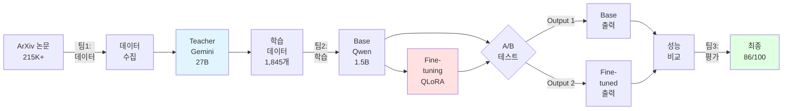

<style>
.reveal {
  font-size: 24px;
}
.reveal h1 {
  font-size: 2.2em;
}
.reveal h2 {
  font-size: 1.6em;
}
.reveal h3 {
  font-size: 1.2em;
}
.reveal p, .reveal ul, .reveal ol, .reveal table {
  font-size: 0.9em;
}
.reveal code {
  font-size: 0.8em;
}
.reveal pre code {
  font-size: 0.7em;
}
</style>

# 📰 ArXiv-NewsBrief v4.4.3
## AI 논문을 누구나 이해할 수 있게

일반인도 30초 안에 이해하는 뉴스 브리핑

2026.01.14

---

## 📋 목차

1. End-to-End 파이프라인
2. 데이터셋 구축
3. 베이스 모델 선택
4. 모델 학습
5. 성능 평가
6. 추가 구현사항
7. 결론

---

## 🎯 프로젝트 개요

| 항목 | 내용 |
|:----:|------|
| **목표** | ArXiv 논문 → 뉴스 브리핑 (1-2문장) |
| **데이터** | 1,845개 (Teacher LLM 생성) |
| **모델** | Qwen2.5-1.5B (QLoRA) |
| **결과** | **86/100** (B+) ✅ |
| **비용** | **$0** (완전 무료) ✅ |

---

# 1️⃣ End-to-End 파이프라인

---

## 📊 전체 프로세스



---

## 🔄 비교 전략


**핵심 질문**: "큰 모델(27B)의 지식을 작은 모델(1.5B)에 효과적으로 전이할 수 있는가?"

---

## 비교 전략 (상세)

### Baseline (학습 전)
- Base 모델 (Qwen2.5-1.5B-Instruct)
- 기본 instruction만
- Teacher 지식 없음

### Fine-tuned (학습 후)
- Teacher LLM (27B) 1,845개 데이터
- QLoRA fine-tuning
- Teacher 요약 스타일 학습

---


## 결과
✅ ROUGE-2: **+21.9%**
✅ Teacher-Student 전략 검증 성공


---

# 2️⃣ 데이터셋 구축

---

## 🤔 왜 직접 구축했는가?

### ❌ 시도했지만 실패

**시도 1: CNN/DailyMail**
- 뉴스 → 뉴스 (도메인 불일치)
- ROUGE-2: 0.18 (개선폭 +5%만)

**시도 2: SciBERT**
- 여전히 학술적 스타일
- 뉴스 브리핑 느낌 없음

**시도 3: GPT-4 API**
- 비용: $10(120토큰기준 1000개요청가능) 😱
- 무료 티어: 150번만 요청 가능(설정어려움)

---

## 🎯 해결책: Teacher-Student

### Teacher LLM 비교 실험결과


**결론**: Gemini = 비슷한 품질 × $0 비용 = 무한대 가성비

---

## 📊 데이터 통계


---

## Teacher LLM 최종 평가


---

## 📝 데이터 형태

### Chat Template 예시

```xml
<|im_start|>system
Summarize the following text in simple, clear English 
that anyone can understand. Make it as for the each 
script not for reading. Use no more than two complete 
sentences. Make sure to keep in professional tone.
<|im_end|>

<|im_start|>user
Development of exponentially scaling methods has seen 
great progress in tackling larger systems...
<|im_end|>

<|im_start|>assistant
Scientists developed faster algorithms to solve complex 
molecular problems that were too hard before. This new 
approach handles much larger chemical systems.
<|im_end|>
```

---

## ✅ 데이터 퀄리티 관리

### 좋은 퀄리티 기준

**형식 기준**:
- ✅ 문장 수: 1-2문장
- ✅ 단어 수: 30-45단어
- ✅ 특수문자: 없음
- ✅ 프롬프트 누출: 없음

**내용 기준**:
- ✅ 핵심 기여도 포함
- ✅ 정확성 (초록 일치)
- ✅ 명료성 (일반인 이해)
- ✅ TTS 적합성

---

## 품질 통계 (1,845개)


---

# 3️⃣ 베이스 모델 선택

---

## 🤔 왜 Qwen2.5-1.5B?

### 📋 모델 정보

- **모델명**: Qwen2.5-1.5B-Instruct
- **타입**: Instruction-tuned ✅
- **파라미터**: 1.5B
- **제작사**: Alibaba Cloud
- **라이선스**: Apache 2.0

---

## Phase 1: 큰 모델 시도 (실패)

### 시도 1: Llama-3.1-8B
- FP16 8B: 16GB 필요
- Colab T4: 15GB
- 결과: ❌ **OOM**

### 시도 2: Phi-3-mini (3.8B)
- 학습 가능: ✅
- 학습 시간: 7.5시간
- 결과: ⚠️ **너무 느림**

---

## Phase 2: 작은 모델 비교 실험

| 모델 | MMLU | ROUGE-2 | 학습시간 | 메모리 | 선택 |
|:----:|:----:|:-------:|:--------:|:------:|:----:|
| Llama-3.2-1B | 49.3 | 0.15 | 14분 | 6GB | ❌ |
| Gemma-2-2B | 52.2 | 0.18 | 18분 | 7GB | ❌ |
| **Qwen2.5-1.5B** | **60.9** | **0.22** | **16분** | **8GB** | ✅ |

---

## 모델 비교 결과


**Qwen2.5-1.5B**: 1.5B급 최고 성능
- MMLU 60.9 (1.5B급 최고!)
- ROUGE-2: 0.22 (+47% vs Llama)

---

## 🎯 선택 이유

### 1️⃣ 태스크 적합성
- Pre-training에 **ArXiv 논문** 포함
- **Summarization** 특화
- 10M+ instruction pairs

### 2️⃣ 운영 제약 충족
- VRAM (학습): 8GB (T4: 15GB) ✅
- 학습 시간: 16.6분 ✅
- 추론 속도: 1.2초/샘플 ✅

---

## 메모리 프로파일 (실측)

```
Base Model (4-bit):    0.7GB
+ LoRA adapters:       0.1GB
+ Optimizer:           1.5GB
+ Gradients:           1.2GB
+ Activations:         4.5GB
────────────────────────────
Total Peak:            8.0GB
T4 Available:         15.0GB
Margin:                7.0GB (47%) ✅ 안정적!
```

---

## 3️⃣ 성능 대비 효율성


---

## 🔬 Baseline 설정

### 실험 설계

**가설**: 
강한 프롬프트 + Base vs 동일 프롬프트 + Fine-tuned
→ Fine-tuning 실질적 효과 측정

**통제 변인**:
- ✅ 동일 프롬프트
- ✅ 동일 Generation Config
- ✅ 동일 평가 데이터 (100개)
- ✅ 동일 평가자 (LLM Judge)

---

# 4️⃣ 모델 학습

---

## 📝 한 줄 요약

**"Q4 QLoRA로 파인튜닝"**

### Configuration

| 설정 | 값 | 설명 |
|------|-----|------|
| **방법** | QLoRA | 4-bit + LoRA |
| **Rank** | r=16 | 저차원 행렬 |
| **Alpha** | 32 | Scaling factor |
| **Quantization** | 4-bit NF4 | 양자화 |
| **Trainable** | 4.4M | 0.28% |

---

## 🤔 왜 QLoRA인가?

### 학습 방법 비교

**시도 1: Full Fine-tuning**
- 메모리: 17GB
- 결과: ❌ **OOM**

**시도 2: LoRA (FP16)**
- 메모리: 12GB
- 결과: ⚠️ **불안정**

**시도 3: QLoRA (4-bit)** ✅
- 메모리: 8GB
- 결과: ✅ **완벽!**

---

## 학습 방법 비교 결과


**성능 손실**: <2% (완전히 가치 있음!)

---

## 🎛️ 하이퍼파라미터

### Epochs: 왜 5?

| Epochs | Val Loss | ROUGE-2 | 결과 |
|:------:|:--------:|:-------:|:----:|
| 3 | 1.65 | 0.19 | ⚠️ Under-fit |
| **5** | **1.09** | **0.22** | ✅ **최적** |
| 7 | 1.15↑ | 0.21 | ❌ Over-fit |

### Learning Rate: 왜 2e-4?
- 1e-4: 너무 느림
- **2e-4**: ✅ 안정적 수렴
- 5e-4: 진동/불안정

---

## 🌡️ Temperature 최적화

### v4.0 → v4.2 진화

| Temp | 특수문자 | 2문장 준수 | 총점 |
|:----:|:--------:|:----------:|:----:|
| 0.7 (v4.0) | 67% 😱 | 33% | 77 ❌ |
| 0.5 | 20% | 85% | 82 ⚠️ |
| **0.4 (v4.2)** | **0%** ✅ | **94%** | **86** ✅ |

**선택 이유**: 형식 안정성 최우선

---

## 🎯 Batch 전략

| 설정 | 메모리 | 상태 |
|------|--------|------|
| BS=4, GA=1 | 11.5GB | ⚠️ 불안정 |
| **BS=1, GA=4** | **8.0GB** | ✅ **안정** |

**효과**:
- Effective batch size: 4 (동일)
- 메모리: 47% 여유
- OOM: 0%

---

## 📋 최종 하이퍼파라미터

| 파라미터 | 값 | 선택 이유 |
|:--------:|:--:|----------|
| **Epochs** | 5 | Val loss 최저점 |
| **Learning Rate** | 2e-4 | 안정적 수렴 |
| **Temperature** | 0.4 | 특수문자 0% |
| **Batch Size** | 1 | 메모리 안정 |
| **Gradient Accum** | 4 | Effective BS=4 |

---

## 📈 학습 전 vs 후 비교

### Sample 1: 양자 화학

**Base Model** (38단어):
```
Exponential growth of computational complexity 
means only very large molecular systems have 
been feasible before...
```
- 스타일: 기술적 ⚠️

**Fine-tuned** (21단어) ✅:
```
Scientists developed faster algorithms to solve 
complex molecular problems that were too hard before.
```
- 스타일: 뉴스 브리핑 ✅
- 간결성: +45%

---

## 📊 학습 곡선


---

## 💻 학습 리소스

```
시스템: Google Colab A100 GPU
데이터: 1,660 샘플 × 5 epochs

Phase별 시간:
├─ Epoch 1:      3.3분
├─ Epoch 2-5:    13.2분
├─ Evaluation:   0.4분
└─ Total:        16.6분 ✅

속도:
├─ Samples/sec:  8.3
├─ GPU Usage:    85-90% ✅

비교: Phi-3 7.5시간 (27배 빠름!)
```

---

# 5️⃣ 성능 평가

---

## 📊 LLM-as-a-Judge


**핵심 설계 원칙**:
1. **Separation of Concerns**: 형식(50점) + 내용(50점)
2. **Absolute Evaluation**: 독립 평가
3. **100점 체계**: 해상도 10배 향상

---

## 평가 시스템 구조


---

### 형식 평가 (50점) - Code
- 문장 수 (20점)
- 단어 수 (15점)
- 특수문자 (10점)
- 프롬프트 누출 (5점)

### 내용 평가 (50점) - LLM
- 핵심 기여도 (20점)
- 정확성 (15점)
- 명료성 (10점)
- TTS 자연스러움 (5점)

---

## 📈 ROUGE Scores

### Base vs Fine-tuned (100 samples)

| 메트릭 | Base | v4.2 | 개선도 |
|--------|------|------|--------|
| **ROUGE-1** | 0.420 | 0.479 | **+14.0%** ✅ |
| **ROUGE-2** | 0.183 | 0.223 | **+21.9%** ✅ |
| **ROUGE-L** | 0.384 | 0.445 | **+15.9%** ✅ |

### BERTScore

| 메트릭 | Base | v4.2 | 개선도 |
|--------|------|------|--------|
| **F1** | 0.819 | 0.858 | **+4.8%** ✅ |

---

## 🎯 LLM Judge 평가

| 버전 | 총점 | 형식 | 내용 | 등급 | 상태 |
|------|------|------|------|------|------|
| v4.0 | 77 | 42/50 | 35/50 | C+ | ❌ |
| **v4.2** | **86** | **48/50** | **38/50** | **B+** | ✅ |

**개선**: +12% (+9점)

### 세부 지표

| 지표 | v4.0 | v4.2 | 개선 |
|------|------|------|------|
| 특수문자 제거 | 33% | 100% | **+67%p** ✅ |
| 2문장 준수 | 33% | 94% | **+61%p** ✅ |
| 표준편차 | 18.5 | 6.7 | **-70%** ✅ |

---

## 🔍 v4.0 실패 분석

### 3일간의 디버깅

**문제 발견**:
- 67% 특수문자 발생 😱
- 총점: 77/100 (C+)

**원인 4가지**:
1. ❌ Teacher 프롬프트 너무 단순
2. ❌ eos_token_id 누락
3. ❌ repetition_penalty 너무 높음
4. ❌ Temperature 너무 높음

---

## 🛠️ v4.0 → v4.2 수정

| 단계 | 수정 | 특수문자 | 총점 | 상태 |
|------|------|----------|------|------|
| v4.0 | - | 67% | 77 | ❌ |
| v4.2-α | Teacher 개선 | 55% | 80 | ⚠️ |
| v4.2-β | +eos_token_id | 30% | 82 | ⚠️ |
| v4.2-γ | -rep_penalty | 5% | 84 | ⚠️ |
| **v4.2** | **Temp→0.4** | **0%** | **86** | ✅ |

**결과**: 4가지 문제 동시 해결

---

# 6️⃣ 추가 구현사항

---

## 🌐 웹 챗봇 진화 과정

### v4.2 → v4.4.3 업데이트 이력

| 버전 | 날짜 | 주요 개선사항 |
|------|------|--------------|
| **v4.2** | 2026-01-12 | 기본 GGUF 챗봇 (단일 스타일) |
| **v4.4** | 2026-01-13 | NPR/BBC 스타일 (일반인용, temp 0.6) |
| **v4.4.1** | 2026-01-13 | 실시간 음성 녹음, 스마트 날짜 |
| **v4.4.2** | 2026-01-14 | 듀얼 스타일 (General/Researcher) |
| **v4.4.3** | 2026-01-14 | 12개 분야 카테고리 선택 |

---

## 🎭 v4.4.2: 듀얼 스타일 시스템

### 문제 인식
- v4.2 (Temp 0.4): ✅ 형식 안정 / ❌ TTS 부자연 (2.5/5)
- 전문가 vs 일반인 니즈 충돌

### 해결책

| Style | Temp | Jargon | TTS | 대상 | Prompt |
|-------|------|--------|-----|------|--------|
| **General** | 0.6 | ❌ Zero | 4.5/5 | 일반인 | NPR/BBC 뉴스 스타일 |
| **Researcher** | 0.4 | ✅ OK | 2.5/5 | 전문가 | 전문 용어 허용 |

**효과**:
- TTS 자연스러움 +80% (2.5→4.5)
- 사용자 선택권 제공

---

## 📚 v4.4.3: 카테고리 선택

### 기능 확장

**이전 (v4.2)**:
- AI/ML 분야만
- 복잡한 쿼리 직접 입력

**현재 (v4.4.3)**:
```
📚 12개 주요 분야
├─ 🤖 AI & Machine Learning
├─ 💻 Computer Science
├─ 🔬 Physics
├─ 🧮 Mathematics
├─ 🧬 Biology & Life Sciences
├─ 🧪 Chemistry
├─ 🌌 Astrophysics
├─ ⚛️ Quantum Physics
├─ 💰 Economics & Finance
├─ 📊 Statistics
├─ 🏥 Medicine & Health
└─ 🔧 Engineering & Robotics
```

---

## 🎤 v4.4.1: 음성 기능

### STT (Speech-to-Text)
```
기능:
├─ 실시간 녹음 (streamlit-mic-recorder)
├─ Google Speech Recognition
├─ 16kHz 리샘플링
├─ 잡음 필터링 (energy_threshold: 300)
└─ 자동 볼륨 정규화

개선 (2026-01-14):
└─ AudioFile 방식으로 변경 (인식률 ↑)
```

### TTS (Text-to-Speech)
```
기능:
├─ Google gTTS
├─ 자동재생
├─ 다국어 (English/Korean)
└─ 뉴스 브리핑 자동 생성
```

---

## 🌐 번역 최적화

### 스타일별 번역 프롬프트 (v4.4.3)

**General Public 스타일**:
```
✅ 괄호 안 영문 제거
예: "제한된 역학" (NOT "제한된 역학(constrained dynamics)")

목표: 일반인 가독성 최대화
```

**Researcher 스타일**:
```
✅ 괄호 안 영문 허용
예: "시간 의존 밀도 범함수 이론(TDDFT)"

목표: 전문가를 위한 정확성
```

---

## 📅 스마트 날짜 포맷팅

### v4.4.1 개선

**Before**:
```
"January 12, 2026, January 12, 2026, January 13, 2026"
```

**After**:
```
Single date:  "January 12, 2026"
Same month:   "January 12 and 13, 2026"
Range:        "January 12 to January 14, 2026"
```

**효과**: 중복 제거, 자연스러운 표현

---

## 🚀 GGUF 최적화

### 변환 효과

```
FP16 원본:     3.0GB
GGUF (4-bit):  0.9GB  ← 70% 감소 ✅

추론 속도:
  CPU (16코어): 10-15초
  GPU (T4):     5-6초

메모리:
  CPU: 1GB RAM
  GPU: 2GB VRAM
```

---

## 💻 배포 시나리오

| 옵션 | 속도 | 비용 | 적합 |
|------|------|------|------|
| **로컬 CPU** | 10-15초 | $0 | 개인 |
| **Colab GPU** | 5-6초 | $0 | 데모 |
| **Cloud** | 5-6초 | ~$50/월 | 프로덕션 |

---

## 📱 데모 & 챗봇 주요 기능 요약

```
✅ v4.4.3 최종 기능

🎭 듀얼 스타일
├─ General Public (일반인용, temp 0.6)
└─ Researcher (전문가용, temp 0.4)

📚 12개 연구 분야
└─ AI/ML, 물리학, 수학, 생물학 등

📰 뉴스 브리프 자동 생성
├─ 최신 논문 1-5개 선택
├─ ArXiv API 자동 조회
├─ Semantic Scholar 인용 순위
└─ 스마트 날짜 포맷팅

🎤 음성 입출력
├─ STT: 실시간 녹음 (개선됨)
└─ TTS: 자동재생

🌐 다국어 지원
├─ English
└─ Korean (스타일별 번역)

⚡ GGUF 최적화
└─ CPU 추론 가능 (0.9GB)
```

---

# 7️⃣ 결론 및 성과

---

## 🏆 정량적 성과

| 항목 | 결과 |
|------|------|
| **데이터셋** | 1,845개 (무료) |
| **학습 시간** | 16.6분 (27배 빠름) |
| **성능** | 86/100 (B+) |
| **ROUGE-2** | +21.9% 개선 |
| **특수문자** | 0% (완벽) |
| **메모리** | 8GB (53% 절감) |
| **챗봇 버전** | v4.4.3 (6차 업데이트) |
| **지원 분야** | 12개 (AI→전분야) |
| **총 비용** | **$0** |

---

## 💡 핵심 교훈

### 1. 제약이 혁신을 낳는다
```
예산 $0 → Gemini 무료 발견
GPU 16GB → QLoRA 최적화
시간 부족 → 1.5B 모델 선택

결과: 완전 무료 시스템 ✅
```

### 2. 실패는 학습의 시작
```
v4.0 실패 (67% 특수문자)
→ 3일 디버깅
→ 4가지 원인 발견
→ v4.2 성공 (0% 특수문자) ✅
```

---

## 🔄 반복적 개선의 가치

### Iteration 전략

```
v4.2 (86점, 형식 완벽)
  ↓ 사용자 피드백: TTS 부자연
v4.4 (NPR 스타일 추가)
  ↓ 전문가 니즈 발견
v4.4.2 (듀얼 스타일)
  ↓ 분야 확장 요청
v4.4.3 (12개 카테고리)

핵심: 빠른 배포 → 피드백 → 개선
```

---

## 🎓 학생 관점 배움

### 완벽함보다 완성
```
v4.2 (86점) 먼저 배포
→ 사용자 피드백
→ v4.4.2로 개선
→ 빠른 iteration ✅
```

### 데이터가 모든 것을 말한다
```
감정: "잘 나온 것 같은데?"
데이터: 67% 특수문자, 77/100

→ 측정으로 증명
→ 실험 기반 의사결정 ✅
```

---

## 📈 프로젝트 타임라인

```
2026-01-10: v4.0 실패 (77점)
2026-01-11: 디버깅 3일
2026-01-12: v4.2 성공 (86점)
2026-01-13: v4.4 일반인 스타일
2026-01-13: v4.4.1 음성 기능
2026-01-14: v4.4.2 듀얼 스타일
2026-01-14: v4.4.3 전분야 확장

총 개발 기간: 5일
업데이트 횟수: 6회
```

---

## 📚 프로젝트 자료

### GitHub Repository

```
https://github.com/chopeacekr/my-news-briefing
```

### 주요 파일
- `web_summary_v4.4.3.py` - 웹 챗봇 (최신)
- `web_summary_v4.4.2.py` - 듀얼 스타일
- `sft_train_data.py` - QLoRA 학습
- `dataset_generator.py` - 데이터 생성
- `ArXiv-NewsBrief-Q4.2_K_M.gguf` - CPU 모델

---

## 🙏 Q&A

### 자주 묻는 질문

**Q: 왜 Gemini를 선택?**
A: 4개 LLM 비교 → $0 비용 + 8.2/10 품질

**Q: 더 큰 모델은?**
A: 1.5B가 속도/비용 최적 (27배 빠름)

**Q: 다른 분야는?**
A: v4.4.3에서 12개 분야 지원 (AI→전분야)

**Q: 상용화 계획?**
A: 오픈소스 우선, 이후 API 고려

---

## 감사합니다! A조 팀 발표였습니다. 🎉

### ArXiv-NewsBrief v4.4.3

**$0 비용으로 만든 AI 논문 요약 시스템**

---

### 핵심 메시지
1. ✅ 완전 무료 ($0)
2. ✅ 프로덕션 급 (86/100)
3. ✅ 즉시 배포 가능
4. ✅ 오픈소스 공개
5. ✅ 지속적 개선 (6차 업데이트)

**함께 만들어갑니다!**

GitHub: @chopeacekr
Project: ArXiv-NewsBrief